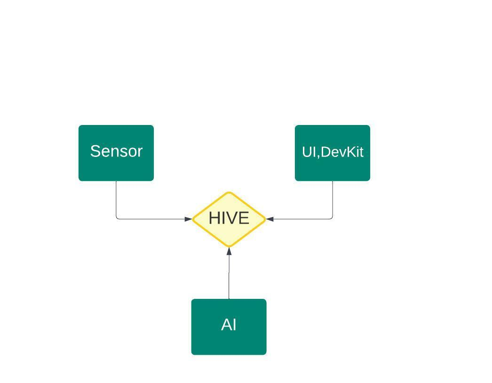

# Brain & Nornir Hackathon 2023

Build a collection of services for processing data, analyzing trends, and triggering actions based on certain conditions. By adding new services to the network it becomes smarter. Each team will build services to provide value to the Hive network. The main criteria is to present a real world use case of your solution for choosen problem.

- Connection to the network
  - Make your solution accessible for the world and by other applications.
  - Use HIVE to tranfer data. Each team should have minimum two HIVE services.
- Participants can use any open source AI data set.
- There are no limitations on the type of AI service you can to build for example:
  - predictive maintanence
  - weather prediction
  - image processing

Smoke Detection system example:
- Sensors, capute the data.
- Store data.
- Train AI to detect smoke from give data set.
- Provide output if smoke is detected 1 if not 0.
- Student kit can be used to display smoke detected output(change display color).

## Participants are free to use

Hardware: Sensors, micro-controllers, any physical device that can be connected
to the network(WiFi). Student kit will be provided with connection to Hive.

## Solution arcitecture example

## Bounty program

As Hive is still in the proof of concept, participants can find some bugs or features that can be fixed or have better implementations. I think if students can explain with an argument the problem that they found, they can be rewarded with some points for their team.
